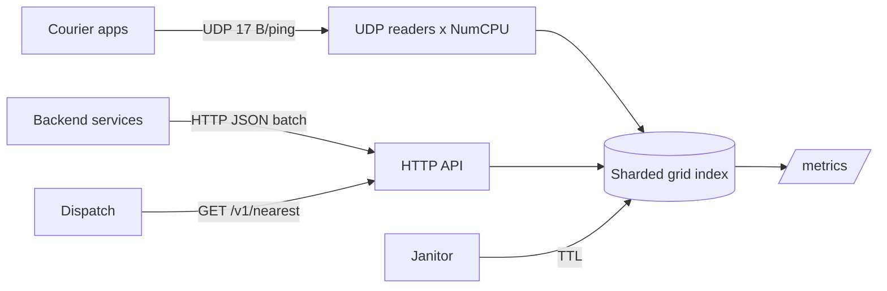

# geo-dispatch

Real-time location index for delivery and ride-hailing: couriers stream their position over a tiny UDP protocol, dispatchers ask "who are the 10 nearest free couriers within 2 km of this order" and get an answer in well under a millisecond.


## Numbers

Measured with `cmd/sim` on a laptop (i7-13620H, Windows 11), simulator and server on the same machine.

| Scenario | Ingest | Dispatch queries | Query latency |
|---|---|---|---|
| 200k couriers, 1 ping/s each | **187k pings/s**, zero loss | **47.6k /s** | p50 0.58 ms, p99 7.9 ms |
| 500k couriers, 1 ping/s each | **467k pings/s**, zero loss | **24.8k /s** | p50 1.1 ms, p99 12.4 ms |
| UDP flood, ingest only | **3.1M updates/s** applied | | |

Micro benchmarks on 200k tracked objects, 16 goroutines:

| Benchmark | ns/op | allocs |
|---|---|---|
| `Upsert` | 166 | 0 |
| `Nearest` k=10, r=2 km | 12 300 | 23 |

## How it works

- **Grid index.** The city is cut into ~500 m cells. Every row has its own longitude step (`500 m / cos(lat)`), so cells stay square from Sochi to Murmansk.
- **Ring search.** `Nearest` walks square rings of cells around the order and keeps the best k in a max-heap. It stops as soon as the next ring is farther than both the radius and the current k-th courier, so a dense downtown query touches a handful of cells.
- **Two sharded tables.** Objects (id → last position) and cells (cell → set of ids) are split into 256 shards each. A courier moving across town locks at most three small shards, readers use `RLock`.
- **Compact wire format.** A ping is 17 bytes: `id u64 | lat i32 | lon i32 | status u8`, up to 80 pings per datagram. That is about 5× less traffic than JSON, which matters for couriers on 3G.
- **Many readers per socket.** One UDP socket, `NumCPU` goroutines reading and decoding straight into the index, 8 MB receive buffer.
- **TTL eviction.** A janitor drops couriers who have not pinged for 30 s, queries also ignore stale positions.



## Correctness

`TestNearestMatchesBruteForce` runs 200 random queries over 20k couriers and checks that the grid search returns exactly the same distances as a full scan. Other tests cover moving between cells, eviction, status filtering and 16 concurrent writers under the race detector.

## API

```bash
# nearest free couriers
curl 'localhost:8081/v1/nearest?lat=55.7558&lon=37.6173&k=10&radius_m=2000'

# any status
curl 'localhost:8081/v1/nearest?lat=55.7558&lon=37.6173&status=any'

# HTTP ingest for services that cannot send UDP
curl -X POST localhost:8081/v1/pings -d '[{"id":42,"lat":55.75,"lon":37.61,"status":1}]'

# one courier
curl localhost:8081/v1/objects/42
```

Prometheus metrics at `/metrics`: updates, queries, evictions, malformed datagrams, tracked objects and a latency histogram for `nearest`.

## Run

```bash
make run     # HTTP :8081, UDP :9091
make test    # race detector on
make bench   # micro benchmarks
make sim     # 200k couriers at 1 Hz plus 64 dispatch workers
make flood   # max ingest
docker compose up --build
```

## What I would add next

- H3 or S2 cells for polygons (zones, surge areas) next to the square grid
- Geo-sharding across nodes by cell range with a thin router
- Snapshot to disk for warm restarts
