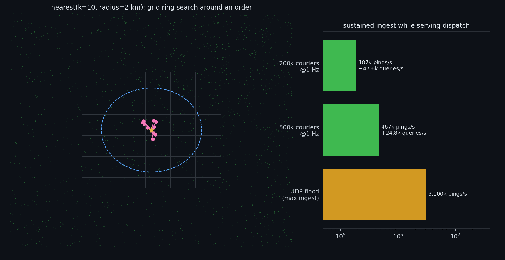
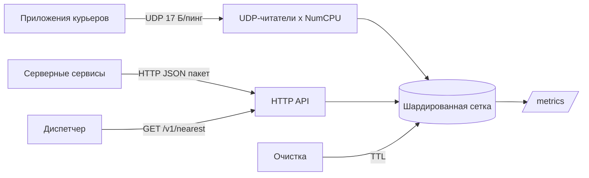

# geo-dispatch

Индекс местоположения в реальном времени для доставки и такси: курьеры шлют координаты по
компактному UDP-протоколу, диспетчер спрашивает «кто 10 ближайших свободных курьеров в
радиусе 2 км от заказа» и получает ответ заметно быстрее миллисекунды.




## Цифры

Замеры `cmd/sim` на ноутбуке (i7-13620H, Windows 11), симулятор и сервер на одной машине.

| Сценарий | Приём | Запросы диспетчера | Задержка запроса |
|---|---|---|---|
| 200 тыс. курьеров, 1 пинг/с каждый | **187 тыс. пингов/с**, без потерь | **47,6 тыс./с** | p50 0,58 мс, p99 7,9 мс |
| 500 тыс. курьеров, 1 пинг/с каждый | **467 тыс. пингов/с**, без потерь | **24,8 тыс./с** | p50 1,1 мс, p99 12,4 мс |
| Поток UDP, только приём | **3,1 млн обновлений/с** применено | | |

Микробенчмарки на 200 тыс. отслеживаемых объектов, 16 горутин:

| Бенчмарк | нс/оп | аллокаций |
|---|---|---|
| `Upsert` | 166 | 0 |
| `Nearest` k=10, r=2 км | 12 300 | 23 |

## Как устроено

- **Сеточный индекс.** Город разрезан на ячейки около 500 м. У каждой строки свой шаг по
  долготе (`500 м / cos(lat)`), поэтому ячейки остаются квадратными от Сочи до Мурманска.
- **Поиск кольцами.** `Nearest` обходит квадратные кольца ячеек вокруг заказа и держит
  лучшие k в куче. Он останавливается, как только следующее кольцо дальше и радиуса, и
  текущего k-го курьера, поэтому запрос в плотном центре трогает считанные ячейки.
- **Две шардированные таблицы.** Объекты (id → последняя позиция) и ячейки (ячейка →
  множество id) разбиты на 256 шардов каждая. Курьер, пересекающий город, блокирует не больше
  трёх маленьких шардов, читатели берут `RLock`.
- **Компактный формат.** Пинг занимает 17 байт: `id u64 | lat i32 | lon i32 | status u8`,
  до 80 пингов в датаграмме. Это примерно в 5 раз меньше трафика, чем JSON, что важно для
  курьеров на 3G.
- **Много читателей на сокет.** Один UDP-сокет, `NumCPU` горутин читают и разбирают пакеты
  прямо в индекс, буфер приёма 8 МБ.
- **Вытеснение по TTL.** Фоновая задача убирает курьеров, которые молчат больше 30 с,
  запросы тоже игнорируют устаревшие позиции.



## Корректность

`TestNearestMatchesBruteForce` выполняет 200 случайных запросов по 20 тыс. курьеров и
проверяет, что поиск по сетке возвращает ровно те же расстояния, что и полный перебор.
Остальные тесты покрывают переход между ячейками, вытеснение, фильтр по статусу и 16
параллельных писателей под детектором гонок.

## API

```bash
# ближайшие свободные курьеры
curl 'localhost:8081/v1/nearest?lat=55.7558&lon=37.6173&k=10&radius_m=2000'

# любой статус
curl 'localhost:8081/v1/nearest?lat=55.7558&lon=37.6173&status=any'

# приём по HTTP для сервисов, которые не могут слать UDP
curl -X POST localhost:8081/v1/pings -d '[{"id":42,"lat":55.75,"lon":37.61,"status":1}]'

# один курьер
curl localhost:8081/v1/objects/42
```

Метрики Prometheus на `/metrics`: обновления, запросы, вытеснения, битые датаграммы,
число объектов и гистограмма задержек `nearest`.

## Запуск

```bash
make run     # HTTP :8081, UDP :9091
make test    # с детектором гонок
make bench   # микробенчмарки
make sim     # 200 тыс. курьеров с частотой 1 Гц и 64 диспетчера
make flood   # максимальный приём
docker compose up --build
```

## Дальше

- Ячейки H3 или S2 для полигонов (зоны, повышенный спрос) рядом с квадратной сеткой
- Географический шардинг по диапазонам ячеек между узлами с тонким маршрутизатором
- Снимок на диск для быстрого рестарта
